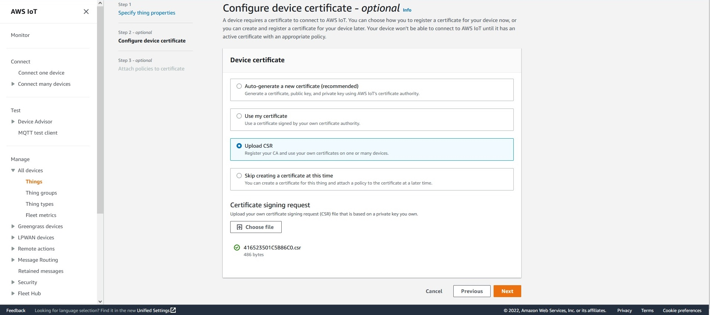
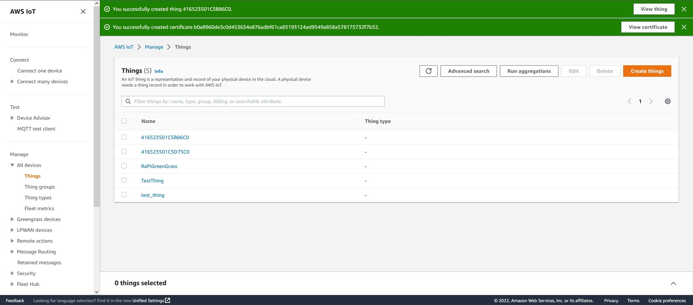
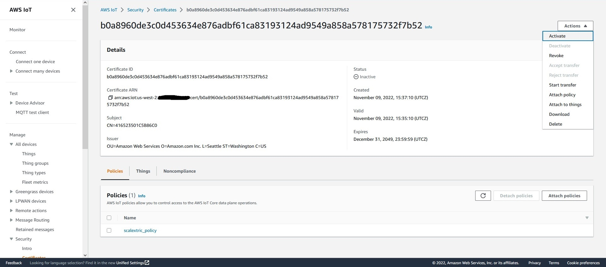

----

[[_TOC_]]

----

# Scalextric Track Installation

For the re:Invent 2022 Builders fair an oval track was used to allow the project to fit into the limited space available.  For your project you can take on any track layout you want because no software will need to change.  I recommend using a track layout tool such as this found at [www.slottrackpro.com](https://www.slottrackpro.com/slot-track-designer/).  This will allow you to calculate track average lane length which will give you average speeds when combined with laptime data.

## re:Invent Oval track Data

The statics for the track are as follows:

- Layout size: 1420 long * 1045 wide
- Inner Lane length: 326.10 cm
- Outer Lane length: 374.10 cm
- Average Lane length: 350.10 cm
- Total Track pieces: 22
- Fastest Lap: 1.8 seconds, average speed 194.5 cmps
- Scale: 1/32
- Scale average distance: 11.2km (6.96 miles)
- Scale average speed: 224.06 kmph (139.23 mph)

## re:Invent Oval Track Bill of Materials

|Total|Part Number|
|:-:|----|
|2|C8200 Quarter Straight 87mm|
|8|C8206 Radius 2 curve 45 degree|
|2|C8027 Half Straight 175mm|
|2|C7018 Starter Grid 175mm|
|1|C7036 Straight Line Change Track 525mm|
|4|C8228 Radius 2 Curve Outer Boarder 45 degree|
|1|C8223 Half Straight Boarders 175mm|
|1|C7042 Digital 6 Car PowerBase|

## re:Invent Oval Track Layout and Schematic

*Note: The diagram tool I used did not include the the C7042 Digital 6 Car Powerbase so it shows the 4 Car Powerbase.  However, both are the same size.*

# Car Data Logger Hardware Installation

The purpose of the Car Data Logger is to record accelerometer data and gyroscope data as the car is driving around the track.  This data can be used to train a machine learning model that can classify car state such as stationary, cornering and straight running.  This classification can then in turn be used to control car braking and throttle position.

## Bill of Materials & Tools

To complete this build you will need some basic tools including:

- Sandpaper 400 grit
- Wire cutters or Box knife
- Soldering iron and solder
- Wire strippers
- Small Philips head screwdriver

The complete parts list is here:

|Part |Quantity|Link|
|---|:-:|---|
|Arduino Nano RP2040 Connect (without headers)|1|https://store.arduino.cc/products/arduino-nano-rp2040-connect|
|Adafruit PowerBoost 1000 Charger|1|https://www.adafruit.com/product/2465|
|500mAh 3.7V LiPo Battery|1|https://thepihut.com/products/500mah-3-7v-lipo-battery?variant=42143258280131|
|Male Breadboard Hook up wire|2|https://www.amazon.com/dp/B01EV70C78|
|Female Breadboard Hook up wire|2|https://www.amazon.com/dp/B01EV70C78|
|Scalextric Chevrolet Monte Carlo|1|https://uk.scalextric.com/products/chevrolet-monte-carlo-green-white-no55-c4079|
|Gorilla Tape|1|https://www.amazon.co.uk/Gorilla-3044010-Tape-32m/dp/B001W030HM/ref=sr_1_5?crid=G31R98FAP220&keywords=gorilla+tape&qid=1667989775&sprefix=gorilla+tape%2Caps%2C91&sr=8-5|
|Silver Foil Tape|1|https://www.amazon.co.uk/Jestio-Aluminium-Insulation-Insulating-Resistant/dp/B09Y3MFNKG/ref=sr_1_1_sspa?keywords=silver+foil+tape&qid=1667989715&sr=8-1-spons&psc=1|
|Blue Tack|1|https://www.amazon.co.uk/Bostik-801103-Adhesive-Blu-tak-Handy/dp/B014JDUBSO/ref=asc_df_B014JDUBSO/?tag=googshopuk-21&linkCode=df0&hvadid=394241490646&hvpos=&hvnetw=g&hvrand=6167577925802913866&hvpone=&hvptwo=&hvqmt=&hvdev=c&hvdvcmdl=&hvlocint=&hvlocphy=1007850&hvtargid=pla-842546161400&psc=1&tag=&ref=&adgrpid=77164351610&hvpone=&hvptwo=&hvadid=394241490646&hvpos=&hvnetw=g&hvrand=6167577925802913866&hvqmt=&hvdev=c&hvdvcmdl=&hvlocint=&hvlocphy=1007850&hvtargid=pla-842546161400|

## In car deployment

These steps will help you install the data logger in the car.  The end state you are looking for is an installation similar to the image below.  You can modify this to meet your own needs depending on the car you want to install it into.

1. Disassemble the car chassis, body and interior.
2. Remove the driver, steering wheel and safety net from the interior.
3. Sand down the remaining interior features until you have a flat surface to mount the components on.
4. Apply a layer of aluminum tape the underside of the interior.  This will act as a radio frequency shield for the Arduino device and prevent interference.
5. Apply a layer of Gorilla tape over the top of the aluminum tape you installed in the previous step.  This prevents short circuits due to the proximity of the motor.  Also apply a layer on the top side of the interior to prevent short circuits with the Arduino.
6. Take 3 pea sized pieces of blue tack and stick them to the battery, then stick this to the interior.  Place it so that it will not block the interior being reassembled with the body.  
7. Trim the male breadboard hookup wires so that they are approximately 1.5 inches long.  Strip the end and then solder to the ground 5 volt power output of the Adafruit PowerBoost 1000 module.
8. Trim the female breadboard hookup wires so that they are approximately 1.5 inches long.  Strip the end and then solder to the VIN and ground of the Arduino Nano RP2040 Connect.  
9. Take 3 pea sized pieces of blue tack and stick them to the Adafruit PowerBoost 1000 module, then stick this on top of the battery.
10. Take 3 pea sized pieces of blue tack and stick them to the Arduino Nano RP2040 Connect, then stick this to the interior.  Place it so that it will not block the interior being reassembled with the body.  
11. Connect the male and female hookup wire connectors to ground and 5 volt respectively.  Connect the battery to the Adafruit PowerBoost 1000.  Verify that the Arduino starts up and you can see the default sketch working using a usb cable to your laptop.  You may need to charge the battery for a while using the usb connector.  The 500mAh battery should run for at least 5 days.  
12. Connect the Arduino to the usb cable and upload the sketch for the IMU.  See the instructions in the folder for the Car Data Logger for information on how to modify the sketch to work with AWS IoT Core in your AWS Account.
13. Once the sketch is installed, you should be able to connect the battery power, reassemble the car and start driving!  Validate that you are receiving messages on the AWS IoT Core topic showing the IMU readings and classifications.

## Car Data Logger Software Installation

There are two basic steps to install the Arduino Nano RP2040 Connect (without headers) data logger.  For the remainder of these instructions I will refer to the device as the Arduino.

First, you have to register the Arduino device with AWS IoT core in the region where you intend to integrate the device and generate the mTLS certificate.  This also involves creating a private key which is stored on the device and matches the certificate.  Second, you have to install the sketch on the Arduino for the data logging itself.

### Device Registration

These instructions assume that you have the Arduino IDE installed on your PC.  See [this link for instructions on how to install 1.18.x](https://www.arduino.cc/en/software). Follow the instructions to install the IDE and the necessary libraries using the [quickstart link here](https://docs.arduino.cc/hardware/nano-rp2040-connect).

1. Open up the Arduino Nano RP2040 Connect box and plug it into your computer with a USB cable.
2. Start the Arduino IDE.  
3. Open the *Tools > manage libraries*.  Search for and install the following libraries:

- ArduinoMqttClient
- ArduinoBearSSL
- ArduinoECCX08
- WiFiNINA
- ArduinoJson
- RTCLib
- ArduinoLSM6DSOX

4. Restart the IDE.
5. Open the sketch to creat a new CSR at *File > Examples > ArduinoECCX08 > Tools > ECCX08CSR*.
6. Check that you have selected the correct port and board for the under Tools menu.  Click on the *Tools > Get Board Info* menu item and you should see the Board Info window appear.  Make a note of the *Serial Number* for your board,  An example is shown below:

7. Click on the *upload* button.  The sketch show now compile and upload to the Arduino.  Click on the Tools > Serial Monitor when it has finished uploading.  Ensure that the baud rate is set to *9600* and the *both NL & CR* is selected.
8. The ATECC hardware security module will not be configured at this stage so you will see a dialog askign you to lock the chip.  Type *Y* into the filed at the top of the window and click *send*.

9. Set the Country Name, Province, Locality, Org Name and Org Unit using values that are relevant to you.  For the *Common Name* use the *serial number* you obtained from *Get Board Info*.  Set the *slot* to *0*.  Type *Y* to create a *new private key*.  

10. The CSR will be generated and displayed on the screen.  Select the text, copy it and save it to a new text document called *<serial_number>.csr*.  You will use this file to register the device with IoT core.

11. Open the *AWS Console* select the *IoT Core* service and the region where you want to deploy the Arduino device.  Select *Manage > All Devices > Things* from the menu.  Click on the *Create things* button.
12. In the *Number of things to create* window, select *Create single thing* and then click on the *Next* button.
13. In the *Thing Properties* window, type in the *serial number* as the *Thing name*.  Click on the *Next* Button.  

14. In the configure device certificate page, select the *Upload CSR* option.  Click on the *choose file* button and select the *<serial_number>.csr* file you created earlier.  Click on the *next* button to continue.

15. Click on the *scalextric_policy* you created earlier and then click on the *create thing* button.

16.  You should not see the success page.  Click on the view certificate button to view the certificate.

17. Click on the *actions > download* the certificate.

18. Rename the certificate file to *<serial_number>-<region>-certificate.pem.crt.txt* so that you know which endpoint it is used for.  They are region specific.  NOTE: you can also register the device in other regions using the CSR you created earlier.  The certificates will vary by region however.
19. Navigate to the *AWS IoT* Settings page in the menu.  Make a note of the endpoint.

20. Navigate to the *AWS IoT > Manage > All Devices > Things* and select the Thing you just registered.  Click on the *certificates* tab.  Select the certificate that was just created.  Click the *actions* button and select *activate*.

### Sketch Installation

Go to the folder `ArduinoCarDataLogger` to learn how to install and test the Arduino sketch.
