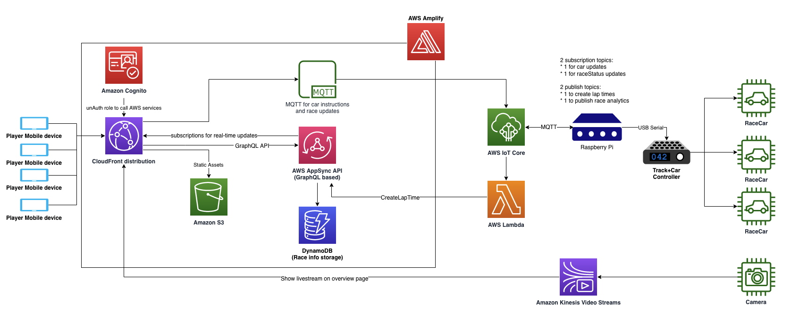

# re:Invent 2022 - builders fair: Slot car racing
This repository holds the relevant code that was used for the Slot car racing re:Invent 2022 project. This repository is divided in 3 parts:
1. The README which you're reading now, explaining the overall setup of the project
2. The `RaceFrontend` folder which contains the code for the Amplify Project that allows people to control cars from their phones, and had a race-overview page with the livestream and race stats.
3. The `RaspberryPythonRaceController` folder which contains the code that we're running on our RaspberryPi to control our slot car track.
4. The `StreamProducer` folder which contains information on how to setup your Kinesis Video Stream producer on another Raspberry Pi to create a live video streaming experience.
5. The `Hardware` folder which contains information on how to build your own cars and race track as well as hints on customization.
6. The `ArduinoCarDataLogger` folder which contains information about how to integrate a car with AWS IoT Core and AWS IoT Analytics.
7. The `Play` folder which contains the operating manual for running the game at an event.

The `RaceFrontend`, `RaspberryPythonRaceController` and `StreamProducer` folders have their own READMEs with information on how to set it up yourself.

<video src='Video/20221130_reInvent_2022_penultimate_race.mp4' width=180/>

**This code is not meant to be run in production applications. The purpose of this repository is to share the code of our proof-of-concept project that we created for re:Invent 2022 and to serve as a way for people to understand how we created it and get inspiration for their own projects. Deploying this Content may incur AWS charges for creating or using AWS chargeable resources highlighted in the diagram below.**

## Architecture

The setup is as following:
1. As part of the Amplify Frontend deployment, you will get a URL to connect to.
2. Connect to the URL with the phones that you want to play with.
3. With a laptop, connect to the URL as well. You can access the Admin dashboard with the pin that you set in the front-end deployment. From the Admin dashboard, you can start and control races.
4. With a secondary laptop or using a second screen with your laptop, open the race overview page. The first time you do this, you'll be asked to sign-up and login via Amazon Cognito. You can do this with any email. This step is required because the live-stream requires credentials, and therefore a login is required. Once logged in, you can zoom in or zoom out using CMD +/- to make sure the overview page fits your screen nicely.
5. You can now start racing! Create a new race, and start the lobby. People will be able to join the race from their phones with their own nickname.

Note: the nickname that people set is stored in the database, so we recommend that players pick a non PII nickname.

## Hardware
The basic hardware required for this setup:
1. A slot car track + cars, we used [Scalextric](https://uk.scalextric.com/) for our project.
2. A RaspberryPi to programmatically control the racetrack.
3. USB Cable to connect the race track controller to the RaspberryPi

For a more comprehensive hardware setup including adding a Arduino based data logger for the car, see the [Hardware](Hardware/README.md) folder. 

## Security

See [CONTRIBUTING](CONTRIBUTING.md#security-issue-notifications) for more information.

## License

This library is licensed under the MIT-0 License. See the LICENSE file.

